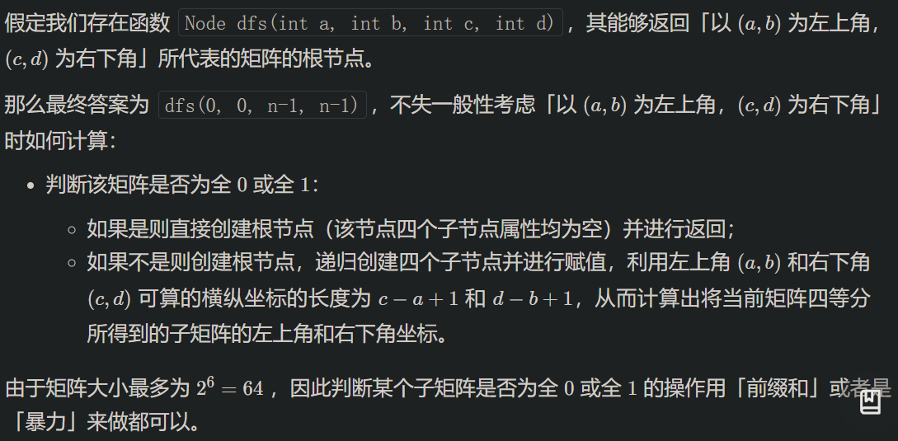

#### [427. 建立四叉树](https://leetcode.cn/problems/construct-quad-tree/)

难度中等149收藏分享切换为英文接收动态反馈

给你一个 `n * n` 矩阵 `grid` ，矩阵由若干 `0` 和 `1` 组成。请你用四叉树表示该矩阵 `grid` 。

你需要返回能表示矩阵的 四叉树 的根结点。

注意，当 `isLeaf` 为 **False** 时，你可以把 **True** 或者 **False** 赋值给节点，两种值都会被判题机制 **接受** 。

四叉树数据结构中，每个内部节点只有四个子节点。此外，每个节点都有两个属性：

- `val`：储存叶子结点所代表的区域的值。1 对应 **True**，0 对应 **False**；
- `isLeaf`: 当这个节点是一个叶子结点时为 **True**，如果它有 4 个子节点则为 **False** 。

```
class Node {
    public boolean val;
    public boolean isLeaf;
    public Node topLeft;
    public Node topRight;
    public Node bottomLeft;
    public Node bottomRight;
}
```

我们可以按以下步骤为二维区域构建四叉树：

1. 如果当前网格的值相同（即，全为 `0` 或者全为 `1`），将 `isLeaf` 设为 True ，将 `val` 设为网格相应的值，并将四个子节点都设为 Null 然后停止。
2. 如果当前网格的值不同，将 `isLeaf` 设为 False， 将 `val` 设为任意值，然后如下图所示，将当前网格划分为四个子网格。
3. 使用适当的子网格递归每个子节点。


如果你想了解更多关于四叉树的内容，可以参考 [wiki](https://en.wikipedia.org/wiki/Quadtree) 。

**四叉树格式：**

输出为使用层序遍历后四叉树的序列化形式，其中 `null` 表示路径终止符，其下面不存在节点。

它与二叉树的序列化非常相似。唯一的区别是节点以列表形式表示 `[isLeaf, val]` 。

如果 `isLeaf` 或者 `val` 的值为 True ，则表示它在列表 `[isLeaf, val]` 中的值为 **1** ；如果 `isLeaf` 或者 `val` 的值为 False ，则表示值为 **0** 。

**示例 1：**


```
输入：grid = [[0,1],[1,0]]
输出：[[0,1],[1,0],[1,1],[1,1],[1,0]]
解释：此示例的解释如下：
请注意，在下面四叉树的图示中，0 表示 false，1 表示 True 。
```

**示例 2：**


```
输入：grid = [[1,1,1,1,0,0,0,0],[1,1,1,1,0,0,0,0],[1,1,1,1,1,1,1,1],[1,1,1,1,1,1,1,1],[1,1,1,1,0,0,0,0],[1,1,1,1,0,0,0,0],[1,1,1,1,0,0,0,0],[1,1,1,1,0,0,0,0]]
输出：[[0,1],[1,1],[0,1],[1,1],[1,0],null,null,null,null,[1,0],[1,0],[1,1],[1,1]]
解释：网格中的所有值都不相同。我们将网格划分为四个子网格。
topLeft，bottomLeft 和 bottomRight 均具有相同的值。
topRight 具有不同的值，因此我们将其再分为 4 个子网格，这样每个子网格都具有相同的值。
解释如下图所示：
```

**示例 3：**

```
输入：grid = [[1,1],[1,1]]
输出：[[1,1]]
```

**示例 4：**

```
输入：grid = [[0]]
输出：[[1,0]]
```

**示例 5：**

```
输入：grid = [[1,1,0,0],[1,1,0,0],[0,0,1,1],[0,0,1,1]]
输出：[[0,1],[1,1],[1,0],[1,0],[1,1]]
```

**提示：**

1. `n == grid.length == grid[i].length`
2. `n == 2^x` 其中 `0 <= x <= 6`

##### 思路

> 递归



##### Code

> 暴力dfs+递归
>

```java
public class Soluton {
    int[][] g;

    public Node construct(int[][] grid) {
        g = grid;
        return dfs(0, 0, g.length - 1, g.length - 1);
    }

    /**
     * @param row1 左上角的行
     * @param col1 左上角的列
     * @param row2 右下角的行
     * @param col2 右下角的列
     * @return 返回能够代表矩阵的根节点
     * 这里判断矩阵是否全为0或者全为1
     * - 如果是,直接创造根节点,并设置子节点为空并返回
     * - 反之,创建根节点,递归创建四个子节点并赋值,,利用左上角(row1,col1)和右下角(row2,col2)
     * 算的横纵坐标的长度为row2-row1+1和col2-col2+1
     * 从而,,计算当前矩阵坐标
     */
    private Node dfs(int row1, int col1, int row2, int col2) {
        boolean isAllSame = true;
        //1.记录左上角开头的数字为0或者1
        /*
            这里判断全为0或者全为1
            可以使用前缀和优化
            如果前缀和为0或者是dtX*dtY的情况下则证明全为一致,反之不然
         */
        int start = g[row1][col1];
        for (int i = row1; i <= row2; i++) {
            for (int j = col1; j <= col2; j++) {
                if (g[i][j] != start) {
                    isAllSame = false;//只要出现和左上角开头数字不同,则标记为false
                }
            }
        }

        //2.根据isAllSame创建节点
        if (isAllSame) {
            return new Node(start == 1, true);//直接创建为叶子节点,并返回
        }
        Node res = new Node(start == 1, false);//开始递归创建四个孩子节点
        int dtX = row2 - row1 + 1, dtY = col2 - col1 + 1;
        //这里根据跨度分成四个部分,,左上,右上,左下,右下
        res.topLeft = dfs(row1, col1, row1 + dtX / 2 - 1, col1 + dtY / 2 - 1);
        res.topRight = dfs(row1, col1 + dtY / 2, row1 + dtX / 2 - 1, col2);
        res.bottomLeft = dfs(row1 + dtX / 2, col1, row2, col1 + dtY / 2 - 1);
        res.bottomRight = dfs(row1 + dtX / 2, col1 + dtY / 2, row2, col2);
        return res;
    }
}

class Node {
    public boolean val;
    public boolean isLeaf;
    public Node topLeft;
    public Node topRight;
    public Node bottomLeft;
    public Node bottomRight;


    public Node() {
        this.val = false;
        this.isLeaf = false;
        this.topLeft = null;
        this.topRight = null;
        this.bottomLeft = null;
        this.bottomRight = null;
    }

    public Node(boolean val, boolean isLeaf) {
        this.val = val;
        this.isLeaf = isLeaf;
        this.topLeft = null;
        this.topRight = null;
        this.bottomLeft = null;
        this.bottomRight = null;
    }

    public Node(boolean val, boolean isLeaf, Node topLeft, Node topRight, Node bottomLeft, Node bottomRight) {
        this.val = val;
        this.isLeaf = isLeaf;
        this.topLeft = topLeft;
        this.topRight = topRight;
        this.bottomLeft = bottomLeft;
        this.bottomRight = bottomRight;
    }
};

```
